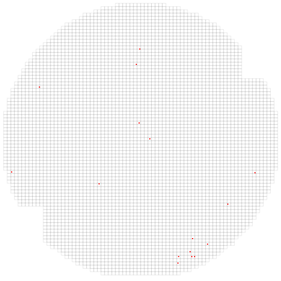

### What am I doing?

I'm exploring the function to auto parsing KLARF file from defect scan tool to wafer defect scaned map then we can use these map to do all sorts of work just like AI image comparison...etc

### Project structure

I have moved all [the original BASIC source code](https://github.com/jingyuan-su/defect-map-draw.git) into a folder for. Note that AI image classification is very important for each everywhere:

> Even in the semiconductor, it's more important for us,for all of your section or department to work instead of engineers manual handle. Such as worse or special map distinguish or using for search.
This project has subfolders corresponding to the languages:

- Python
- JavaScript
- HTML

### Project goals

Feel free to begin converting this function into your project. But first, a few guidelines:

- **Semiconductor knowledge**. pls make sure that you understand what's KLARF file?

> Came from Semicondutor defect scanning tool's output file for server parsing or others just like that.There's sorts of parameters to indicate the wafer which was scan is good or NG for defect performance.
And this KLARF file should be help for EDA software to draw or create the visual defect scaned map.

```
    FileVersion 1 1;
    FileTimestamp 10-19-21 10:06:32;
    InspectionStationID "AMAT" "COMPLUS 3T" "HYCPS04";
    SampleType WAFER;
    ResultTimestamp 10-19-21 10:04:09;
    LotID "HJU008";
    SampleSize 1 200;
    SetupID "03R3" 10-19-21 10:03:42;
    StepID "IMD2_SRO";
    SampleOrientationMarkType NOTCH;
    OrientationMarkLocation DOWN;
    DiePitch 2.4899600000e+03 2.2599200000e+03;
    DieOrigin 0.000000 0.000000;
    WaferID "25";
    Slot 25;
    SampleCenterLocation 2.3948000000e+03 2.0903200000e+03;
    ClassLookup 276
```
- **Visual Defect map**. After KLARF file parser the result should be like this:


- **Websockets using**. python should be backend for KLARF file parser and JS should be map printer!

### Have fun!

Thank you for taking part in this project!
